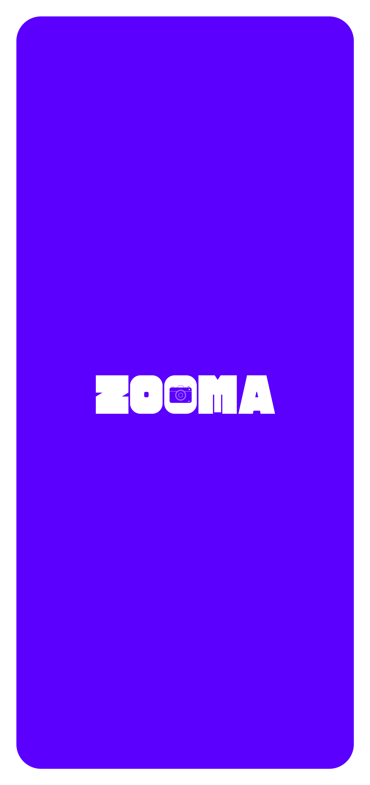
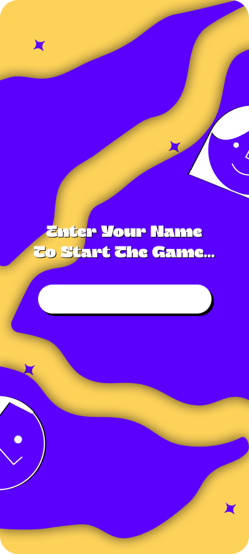
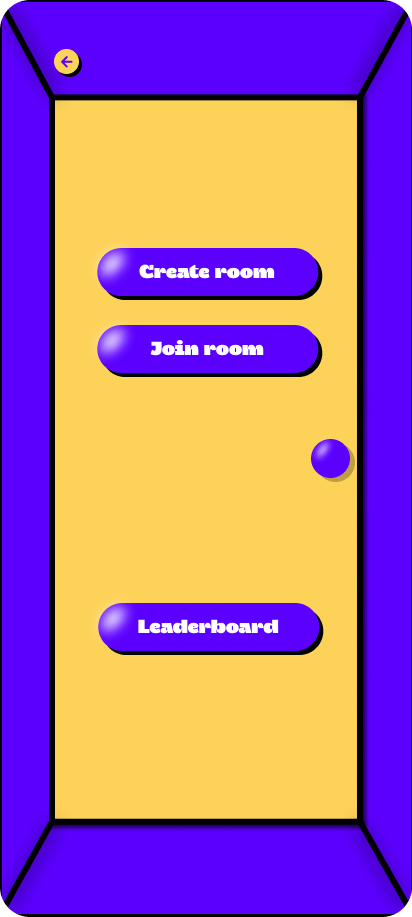
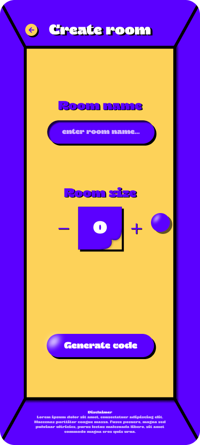
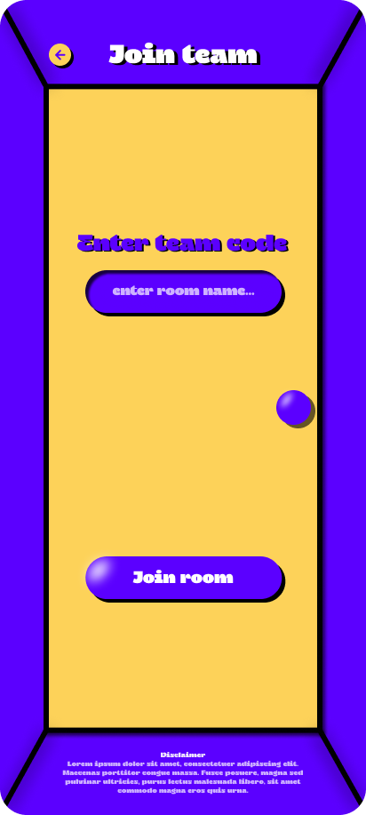

# 🎮 Zooma - Real-time Photo Challenge App

A modern, real-time multiplayer game where players complete photo-based tasks in teams, with mentors reviewing submissions and managing leaderboards.

## 📱 Screenshots

  
  
  
  
  

## ✨ Features

### 🎯 Core Gameplay
- **Room-based multiplayer** - Mentors create room, players join with room codes
- **Photo-based tasks** - Players complete challenges by taking photos
- **Real-time updates** - Live scoring, leaderboards, and notifications
- **Mentor approval system** - Review and approve/reject task submissions
- **Dynamic scoring** - Points awarded based on task difficulty

### 🚀 Technical Features
- **Cross-platform mobile app** - Built with Flutter
- **Image processing** - Automatic photo optimization and compression
- **Secure file handling** - Validated uploads with size/type restrictions
- **RESTful API** - Clean, documented backend endpoints

## 🎮 How to Play

### For Mentors (Game Masters):
1. **Create Room** - Generate a unique 6-character room code
2. **Share Code** - Give the code to players to join
3. **Monitor Players** - Watch real-time player activity
4. **Review Submissions** - Approve or reject photo submissions
5. **Manage Leaderboard** - View final scores and rankings

### For Players:
1. **Join Room** - Enter the room code provided by mentor
2. **Complete Tasks** - Take photos for assigned challenges
3. **Submit Photos** - Upload images for mentor review
4. **Earn Points** - Get scored based on approved submissions
5. **Climb Leaderboard** - Compete with other players
## 🤝 Contributing

We welcome contributions! Please see our [Contributing Guide](CONTRIBUTING.md) for details.

### Development Workflow
1. Fork the repository
2. Create a feature branch (`git checkout -b feature/amazing-feature`)
3. Commit your changes (`git commit -m 'Add amazing feature'`)
4. Push to the branch (`git push origin feature/amazing-feature`)
5. Open a Pull Request

### Code Style
- **Backend**: ESLint + Prettier
- **Frontend**: Dart formatter
- **Commits**: Conventional Commits format

## 📄 License

This project is licensed under the MIT License - see the [LICENSE](LICENSE) file for details.

## 📞 Support
- 🐛 **Issues**: [GitHub Issues](https://github.com/Muflih-uk/Bingo/issues)

---

  <strong>Built with ❤️ for fun and learning</strong>
   
  <a href="#top">⬆️ Back to top</a>

